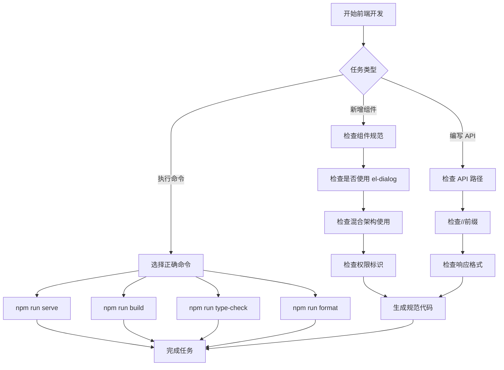

## 核心原则

1. **混合架构优先**：使用 Element Plus + Tailwind CSS + 设计系统的混合架构（详细规范参考 [前端设计技能](../前端设计/SKILL.md)）
2. **规范检查自动触发**：编写代码时自动检查 API 路径、响应格式、弹窗规范等
3. **命令执行准确**：根据项目实际配置执行正确的 npm 命令
4. **代码生成规范化**：生成的组件必须符合项目架构和命名规范

---

## 核心功能概览

**组件规范检查**、**混合架构开发**、**API 规范检查**、**开发命令执行**、**代码脚手架生成**

---

## 工作流程



---

## 功能 1：组件规范检查与生成

### 1.1 弹窗规范检查

**触发条件**：创建新页面或需要用户交互时

**自动检查**：
- ✅ 必须使用 `el-dialog` 弹窗，禁止使用 `window.open()` 或路由跳转
- ✅ 单页面 + 弹窗模式，禁止打开新页面
- ✅ 权限操作（编辑/删除）必须使用弹窗确认

**正面示例** ✅：
```vue
<template>
  <div class="p-4">
    <el-button @click="showDialog = true">编辑</el-button>
    
    <el-dialog v-model="showDialog" title="编辑">
      <el-form>...</el-form>
    </el-dialog>
  </div>
</template>
```

**反面示例** ❌：
```vue
<template>
  <div class="p-4">
    <el-button @click="window.open('/edit')">编辑</el-button>
    <!-- 或 -->
    <el-button @click="$router.push('/edit')">编辑</el-button>
  </div>
</template>
```

---

### 1.2 API 路径检查

**触发条件**：编写前端 API 调用时

**自动检查**：
- ✅ API 路径必须使用 `/` 前缀（如 `/user`）
- ❌ 禁止使用 `/api/user` 或 `/user`

**检查规则**：
```typescript
// ✅ 正确：使用 // 前缀
url: '//roles',
url: `/roles/${roleId}/available-menus`,

// ❌ 错误：使用 /api 前缀
url: '/api/user',  // 提醒："⚠️ 应使用 //user 而非 /api/user"
```

---

### 1.3 响应格式检查

**触发条件**：处理 API 响应时

**自动检查**：
- ✅ 使用 `res.code` 判断成功/失败（0 表示成功）
- ✅ 列表字段使用 `list` 和 `total`
- ✅ 分页参数使用 `page` 和 `pageSize`

**响应接口规范**：
```typescript
interface ApiResponse<T> {
  code: number      // 0 表示成功，非 0 表示失败
  data: T           // 返回数据
  msg: string       // 消息提示
}

// 列表响应
interface ListResponse<T> {
  list: T[]         // 列表数据
  total: number     // 总数
  page: number      // 页码
  pageSize: number  // 每页数量
}
```

---

### 1.4 权限标识检查

**触发条件**：编写权限控制代码时

**自动检查**：
- ✅ 权限标识使用 `update` 而非 `edit`
- ✅ 使用 `v-auth` 指令或权限判断

**检查规则**：
```vue
<!-- ✅ 正确：使用 update -->
<el-button v-auth="'user:update'">编辑</el-button>

<!-- ❌ 错误：使用 edit -->
<el-button v-auth="'user:edit'">  <!-- 提醒："⚠️ 应使用 user:update 而非 user:edit" -->
```

---

## 功能 2：混合架构开发规范

**详细说明**：Element Plus + Tailwind CSS 协同使用的完整规范请参考 [前端设计技能](../前端设计/SKILL.md)。

**核心原则**：
- **布局/排版/装饰** → 使用 Tailwind CSS
- **复杂交互组件** → 使用 Element Plus
- **深度定制** → 使用 SCSS + CSS 变量

---

## 功能 3：开发命令执行

### 3.1 依赖安装

**命令**：`npm install`

**使用场景**：
- 项目初始化后
- 新增 npm 包后
- 切换分支后
- `package.json` 变更后

---

### 3.2 开发环境启动

**命令**：`npm run serve`

**功能**：启动开发服务器，支持热重载，使用 `vite --host --mode development`

**使用场景**：
- 日常开发
- 功能调试
- 本地测试

**注意**：项目使用 `vite` 而非 `webpack`，命令是 `npm run serve` 而非 `npm run dev`

---

### 3.3 生产环境构建

**命令**：`npm run build`

**功能**：构建生产版本，执行类型检查和打包

**实际执行**：
```json
{
  "build": "run-p type-check \"build-only {@}\" --",
  "build-only": "vite build --mode production"
}
```

**使用场景**：
- 部署到生产环境
- 测试生产构建
- 发布新版本

---

### 3.4 类型检查

**命令**：`npm run type-check`

**功能**：执行 TypeScript 类型检查，使用 `vue-tsc --build`

**使用场景**：
- 提交代码前
- 修改类型定义后
- 定期质量检查
- 生产构建前（自动执行）

---

### 3.5 代码格式化

**命令**：`npm run format` 或 `npm run lint -- --fix`

**功能**：
- `npm run format`：使用 Prettier 格式化代码
- `npm run lint -- --fix`：使用 ESLint 检查并修复

**使用场景**：
- 保存文件后
- 提交代码前
- 代码审查前

---

## 功能 4：业务组件使用规范

### 4.1 IxCard - 业务卡片

**使用场景**：包裹内容区域，提供统一的卡片样式

```vue
<template>
  <IxCard title="卡片标题" hover-effect padding="md" shadow="md">
    <template #header-actions>
      <el-button size="small" type="primary">操作</el-button>
    </template>

    卡片内容

    <template #footer>
      <div class="text-sm text-gray-500">页脚信息</div>
    </template>
  </IxCard>
</template>
```

---

### 4.2 IxStatCard - 统计卡片

**使用场景**：展示统计数据，支持趋势、进度等

```vue
<template>
  <IxStatCard
    title="总用户数"
    value="12,345"
    change="+12.5%"
    change-type="positive"
    change-label="较上月"
    icon="User"
    color="blue"
    :progress="75"
    progress-label="完成度"
  />
</template>
```

---

### 4.3 IxPageTemplate - 页面模板

**使用场景**：标准页面布局，包含标题、描述、面包屑等

```vue
<template>
  <IxPageTemplate
    title="页面标题"
    description="页面描述"
    show-header
    show-breadcrumb
    :breadcrumb-items="[{ name: '首页', to: '/' }, { name: '用户管理' }]"
    show-refresh
    @refresh="handleRefresh"
  >
    <template #header-actions>
      <el-button type="primary">添加</el-button>
    </template>

    页面内容

    <template #footer>
      <p>自定义页脚</p>
    </template>
  </IxPageTemplate>
</template>
```

---

## 功能 5：项目架构规范

### 5.1 目录结构

```
src/
├── api/              # API 接口
│   ├── index.ts      # 统一导出
│   └── modules/      # 模块化管理
├── components/       # 组件
│   ├── business/     # 业务组件
│   └── layout/       # 布局组件
├── views/            # 页面视图
│   ├── system/       # 系统管理
│   ├── log/          # 日志管理
│   └── monitor/      # 监控管理
├── stores/           # 状态管理
├── types/            # 类型定义
└── utils/            # 工具函数
```

---

### 5.2 API 模块化规范

**文件位置**：`src/api/modules/xxx.ts`

**示例**：
```typescript
import service from '@/utils/request'
import type { ApiResponse } from '@/types'
import type { Role } from '@/types/role'

// 获取角色列表
export const getRoleList = (params?: {
  page: number
  pageSize: number
  name?: string
  status?: number
}): Promise<ApiResponse<{ list: Role[]; total: number }>> => {
  return service({
    url: '//roles',
    method: 'get',
    params,
  })
}

// 创建角色
export const createRole = (data: CreateRoleRequest): Promise<ApiResponse<Role>> => {
  return service({
    url: '//roles',
    method: 'post',
    data,
  })
}
```

---

### 5.3 类型定义规范

**文件位置**：`src/types/xxx.ts`

**示例**：
```typescript
// 角色类型
export interface Role {
  id: string
  name: string
  description: string
  status: number
  createdAt: string
}

// 创建角色请求
export interface CreateRoleRequest {
  name: string
  description: string
  status: number
}
```

---

## 质量检查清单

在提交代码前，自动检查以下项目：

- [ ] **组件规范**：是否使用 `el-dialog` 而非打开新页面
- [ ] **API 路径**：是否使用 `/` 前缀
- [ ] **响应处理**：是否使用 `res.code` 判断
- [ ] **权限标识**：是否使用 `update` 而非 `edit`
- [ ] **混合架构**：是否正确使用 Tailwind + Element Plus
- [ ] **类型安全**：是否定义并使用 TypeScript 类型
- [ ] **代码格式化**：是否执行 `npm run format`
- [ ] **类型检查**：是否执行 `npm run type-check`
- [ ] **响应式**：是否考虑移动端适配
- [ ] **暗黑模式**：是否支持 `dark:` 前缀

---

## 常见问题

**Q1: 使用 npm run serve 还是 npm run dev？**
- A: 项目使用 `npm run serve`（基于 vite）

**Q2: API 路径使用什么前缀？**
- A: 使用 `/` 前缀，如 `/roles`，而非 `/api/roles`

**Q3: 如何选择使用 Tailwind 还是 SCSS？**
- A: 布局/间距/排版用 Tailwind，复杂动画/深度定制用 SCSS

**Q4: 弹窗使用什么组件？**
- A: 使用 `el-dialog`，禁止使用 `window.open()` 或路由跳转

**Q5: 权限标识命名规范？**
- A: 使用 `模块：操作` 格式，如 `user:update`，不使用 `user:edit`
